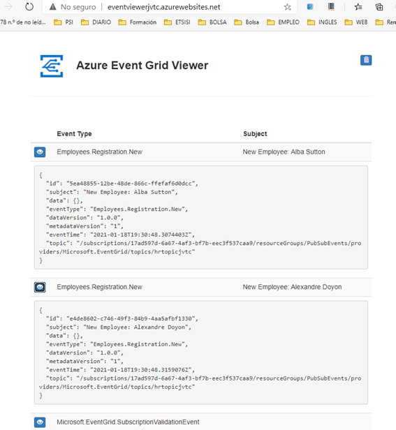

# AZ-204T00_MOD10_LAK_Starter

JOSE VICENTE TEJERO - 18/01/2021

RESUMEN
Lab: Publishing and subscribing to Event Grid events

Student lab answer key

Microsoft Azure user interface

Exercise 1: Create Azure resources

Task 1: Open the Azure portal

1. On the     taskbar, select the **Microsoft Edge** icon.
2. In the     open browser window, go to the Azure portal ([https://portal.azure.com](https://portal.azure.com/)).
3. Enter     the email address for your Microsoft account, and then select **Next**.
4. Enter     the password for your Microsoft account, and then select **Sign in**.

**Note**: If this is your first time signing in to the Azure portal, you’ll be offered a tour of the portal. Select **Get Started** to skip the tour and begin using the portal.

Task 2: Open Azure Cloud Shell

1. In the     portal, select the **Cloud Shell** icon to open a new shell instance.

**Note**: The **Cloud Shell** icon is represented by a greater than sign (>) and underscore character (_).

1. If this     is your first time opening Cloud Shell using your subscription, you can     use the **Welcome to Azure Cloud Shell Wizard** to configure     Cloud Shell. Perform the following actions in the wizard:

2. - When a      dialog box prompts you to create a new storage account to begin using the      shell, accept the default settings, and then select **Create      storage**.

**Note**: Wait for Cloud Shell to finish its initial setup procedures before continuing with the lab. If you don’t notice the **Cloud Shell** configuration options, this is most likely because you’re using an existing subscription with this course’s labs. The labs are written with the presumption that you’re using a new subscription.

1. In     Azure portal, at the **Cloud Shell** command prompt enter the     following command, and then select Enter to get the version of the Azure     Command-Line Interface (Azure CLI) tool:

CodeCopy

az --version

Task 3: View the Microsoft.EventGrid provider registration

1. At     the **Cloud Shell** command prompt in the portal, perform the     following actions:

2. 1. Enter      the following command, and then select Enter to get a list of subgroups      and commands at the root level of the Azure CLI:

CodeCopy

az --help

1. 1. Enter      the following command, and then select Enter to get a list of the      commands that are available for resource providers:

CodeCopy

az provider --help

1. 1. Enter      the following command, and then select Enter to list all currently registered      providers:

CodeCopy

az provider list

1. 1. Enter      the following command, and then select Enter to list just the namespaces      of the currently registered providers:

CodeCopy

az provider list --query "[].namespace"

1. 1. Review      the list of currently registered providers. Notice that the **Microsoft.EventGrid** provider      is currently included in the list of providers.

2. Close     the Cloud Shell pane.

Task 4: Create a custom Event Grid topic

1. In the     Azure portal’s navigation pane, select **Create a resource**.

2. On the **New** blade,     find the **Search the Marketplace** text box.

3. In the     search box, enter **Event Grid Topic**, and then select Enter.

4. On     the **Everything** search results blade, select the **Event     Grid Topic** result.

5. On     the **Event Grid Topic** blade, select **Create**.

6. On     the **Create Topic** blade, perform the following actions:

7. 1. In      the **Name** text box, enter **hrtopic\*[yourname]\***.
   2. In      the **Resource group** section, select **Create new**,      enter **PubSubEvents**, and then select **OK**.
   3. From      the **Location** drop-down list, select the **(US)      East US** region.
   4. From      the **Event Schema** drop-down list, select **Event      Grid Schema**, and then select **Create**.

**Note**: Wait for Azure to finish creating the topic before you continue with the lab. You’ll receive a notification when the app is created.

Task 5Deploy the Azure Event Grid viewer to a web app

1. In the     Azure portal’s navigation pane, select **Create a resource**.
2. On     the **New** blade, find the **Search the Marketplace** text     box.
3. In the     search box, enter **Web**, and then select Enter.
4. On     the **Everything** search results blade, select the **Web     App** result.
5. On     the **Web App** blade, select **Create**.
6. On the     second **Web App** blade, find the tabs on the blade, such     as **Basics**.

**Note**: Each tab represents a step in the workflow to create a new web app. You can select **Review + Create** at any time to skip the remaining tabs.

1. On     the **Basics** tab, perform the following actions:

2. 1. Leave      the **Subscription** text box set to its default value.
   2. In      the **Resource group** section, select **PubSubEvents**.
   3. In      the **Name** text box, enter **eventviewer\*[yourname]\***.
   4. In      the **Publish** section, select **Docker Container**.
   5. In      the **Operating System** section, select **Linux**.
   6. From      the **Region** drop-down list, select the **East US** region.
   7. In      the **Linux Plan (East US)** section, select **Create      new**.
   8. In      the **Name** text box, enter the value **EventPlan**,      and then select **OK**.
   9. Leave      the **SKU and size** section set to its default value.
   10. Select **Next:      Docker**.

1. On     the **Docker** tab, perform the following actions:

2. 1. From      the **Options** drop-down list, select **Single      Container**.
   2. From      the **Image Source** drop-down list, select **Docker      Hub**.
   3. From      the **Access Type** drop-down list, select **Public**.
   4. In      the **Image and tag** text box, enter **microsoftlearning/azure-event-grid-viewer:latest**.
   5. Select **Review      + Create**.

3. On     the **Review + Create** tab, review the options that you     selected during the previous steps.

4. Select **Create** to     create the web app using your specified configuration.

**Note**: Wait for Azure to finish creating the web app before you continue with the lab. You’ll receive a notification when the app is created.

Review

In this exercise, you created the Event Grid topic and a web app that you will use throughout the remainder of the lab.

Exercise 2: Create an Event Grid subscription

Task 1: Access the Event Grid Viewer web application

1. In the     Azure portal’s navigation pane, select **Resource groups**.
2. On     the **Resource groups** blade, select the **PubSubEvents** resource     group that you created earlier in this lab.
3. On     the **PubSubEvents** blade, select the **eventviewer\*[yourname]\*** web     app that you created earlier in this lab.
4. On     the **App Service** blade, in the **Settings** category,     select the **Properties** link.
5. 
6. In     the **Properties** section, record the value of the **URL** text     box. You’ll use this value later in the lab.
7. Select **Overview**.
8. In     the **Overview** section, select **Browse**.
9. Observe     the currently running **Azure Event Grid viewer** web     application. Leave this web application running for the remainder of the     lab.

**Note**: This web application will update in real-time as events are sent to its endpoint. We will use this to monitor events throughout the lab.

1. Return     to your currently open browser window that’s displaying the Azure portal.

Task 2: Create new subscription

1. In the     Azure portal’s navigation pane, select **Resource groups**.

2. On     the **Resource groups** blade, select the **PubSubEvents** resource     group that you created earlier in this lab.

3. On     the **PubSubEvents** blade, select the **hrtopic\*[yourname]\*** Event     Grid topic that you created earlier in this lab.

4. On     the **Event Grid Topic** blade, select **+ Event     Subscription**.

5. On     the **Create Event Subscription** blade, perform the     following actions:

6. 1. In      the **Name** text box, enter **basicsub**.
   2. In      the **Event Schema** list, select **Event Grid Schema**.
   3. In      the **Endpoint Type** list, select **Web Hook**.
   4. Select **Endpoint**.
   5. In      the **Select Web Hook** dialog box, in the **Subscriber      Endpoint** text box, enter the **Web App URL** value      that you recorded earlier, ensure it uses an **https://** prefix,      add the suffix **/api/updates**, and then select **Confirm      Selection**.

**Note**: For example, if your **Web App URL** value is **http://eventviewerstudent.azurewebsites.net/**, then your **Subscriber Endpoint** would be **https://eventviewerstudent.azurewebsites.net/api/updates**.

1. 1. Select **Create**.

**Note**: Wait for Azure to finish creating the subscription before you continue with the lab. You’ll receive a notification when the app is created.

Task 3: Observe the subscription validation event

1. Return     to the browser window displaying the **Azure Event Grid viewer** web     application.
2. Review     the **Microsoft.EventGrid.SubscriptionValidationEvent** event     that was created as part of the subscription creation process.
3. Select     the event and review its JSON content.
4. Return     to your currently open browser window with the Azure portal.

Task 4: Record subscription credentials

1. In the     Azure portal’s navigation pane, select **Resource groups**.
2. On     the **Resource groups** blade, select the **PubSubEvents** resource     group that you created earlier in this lab.
3. On     the **PubSubEvents** blade, select the **hrtopic\*[yourname]\*** Event     Grid topic that you created earlier in this lab.
4. On     the **Event Grid Topic** blade, record the value of the **Topic     Endpoint** field. You’ll use this value later in the lab.
5. In     the **Settings** category, select the **Access keys** link.
6. In     the **Access keys** section, record the value of the **Key     1** text box. You’ll use this value later in the lab.

Review

In this exercise, you created a new subscription, validated its registration, and then recorded the credentials required to publish a new event to the topic.

Exercise 3: Publish Event Grid events from .NET

Task 1: Create a .NET project

1. On     the **Start** screen, select the **Visual Studio Code** tile.
2. From     the **File** menu, select **Open Folder**.
3. In     the **File Explorer** window that opens, browse to **Allfiles     (F):\Allfiles\Labs\10\Starter\EventPublisher**, and then select **Select     Folder**.
4. In     the **Visual Studio Code** window, right-click or activate     the shortcut menu for the Explorer pane, and then select **Open in     Terminal**.
5. At the     open command prompt, enter the following command, and then select Enter to     create a new .NET project named **EventPublisher** in the     current folder:

CodeCopy

dotnet new console --name EventPublisher --output . -f netcoreapp3.1

**Note**: The **dotnet new** command will create a new **console** project in a folder with the same name as the project.

1. At the     command prompt, enter the following command, and then select Enter to     import version 3.2.0 of **Microsoft.Azure.EventGrid** from     NuGet:

CodeCopy

dotnet add package Microsoft.Azure.EventGrid --version 3.2.0

**Note**: The **dotnet add package** command will add the **Microsoft.Azure.EventGrid** package from NuGet. For more information, go to [Microsoft.Azure.EventGrid](https://www.nuget.org/packages/Microsoft.Azure.EventGrid/3.2.0).

1. At the     command prompt, enter the following command, and then select Enter to     build the .NET web application:

CodeCopy

dotnet build

1. Select **Kill     Terminal** or the **Recycle Bin** icon to close the     currently open terminal and any associated processes.

Task 2: Modify the Program class to connect to Event Grid

1. In     the Explorer pane of the **Visual Studio Code** window,     open the **Program.cs** file.
2. On the     code editor tab for the **Program.cs** file, delete all the     code in the existing file.
3. Add the     following line of code to import the **Microsoft.Azure.EventGrid**,     and **Microsoft.Azure.EventGrid.Models** namespaces from     the **Microsoft.Azure.EventGrid** package imported from NuGet:

CodeCopy

using Microsoft.Azure.EventGrid;

using Microsoft.Azure.EventGrid.Models;

1. Add the     following lines of code to add **using** directives for the     built-in namespaces that will be used in this file:

CodeCopy

using System;

using System.Collections.Generic;

using System.Threading.Tasks;

1. Enter     the following code to create a new **Program** class:

CodeCopy

public class Program

{

}

1. In     the **Program** class, enter the following line of code to     create a new string constant named **topicEndpoint**:

CodeCopy

private const string topicEndpoint = "";

1. Update     the **topicEndpoint** string constant by setting its value to     the **Topic Endpoint** of the Event Grid topic that you     recorded earlier in this lab.
2. In     the **Program** class, enter the following line of code to     create a new string constant named **topicKey**:

CodeCopy

private const string topicKey = "";

1. Update     the **topicKey** string constant by setting its value to     the **Key** of the Event Grid topic that you recorded earlier     in this lab.
2. In the **Program** class,     enter the following code to create a new asynchronous **Main** method:

CodeCopy

public static async Task Main(string[] args)

{

}

1. Observe     the **Program.cs** file, which should now include the     following lines of code:

CodeCopy

using Microsoft.Azure.EventGrid;

using Microsoft.Azure.EventGrid.Models;

using System;

using System.Collections.Generic;

using System.Threading.Tasks;

 

public class Program

{

  private const string topicEndpoint = "<topic-endpoint>";

  private const string topicKey = "<topic-key>";

​    

  public static async Task Main(string[] args)

  {

  }

}

Task 3: Publish new events

1. In     the **Main** method, perform the following actions to publish     a list of events to your topic endpoint:

2. 1. Add      the following line of code to create a new variable named **credentials** of      type [**TopicCredentials**](https://microsoftlearning.github.io/AZ-204-DevelopingSolutionsforMicrosoftAzure/Instructions/Labs/AZ-204_10_lab_ak.html), using the **topicKey** string      constant as a constructor parameter:

CodeCopy

TopicCredentials credentials = new TopicCredentials(topicKey);

1. 1. Add      the following line of code to create a new variable named **client** of      type [**EventGridClient**](https://microsoftlearning.github.io/AZ-204-DevelopingSolutionsforMicrosoftAzure/Instructions/Labs/AZ-204_10_lab_ak.html), using the **credentials** variable      as a constructor parameter:

CodeCopy

EventGridClient client = new EventGridClient(credentials);

1. 1. Add      the following line of code to create a new variable named **events** of      type **List**.

CodeCopy

List<EventGridEvent> events = new List<EventGridEvent>();

1. 1. Add      the following lines of code to create a new variable named **firstPerson** of      an anonymous type:

CodeCopy

var firstPerson = new

{

  FullName = "Alba Sutton",

  Address = "4567 Pine Avenue, Edison, WA 97202"

};

1. 1. Add      the following block of code to create a new variable named **firstEvent** of      type **EventGridEvent**, and then populate the **EventGridEvent** variable      with sample data:

CodeCopy

EventGridEvent firstEvent = new EventGridEvent

{

  Id = Guid.NewGuid().ToString(),

  EventType = "Employees.Registration.New",

  EventTime = DateTime.Now,

  Subject = $"New Employee: {firstPerson.FullName}",

  Data = firstPerson,

  DataVersion = "1.0.0"

};

1. 1. Add      the following line of code to add the **firstEvent** instance      to your **events** list:

CodeCopy

events.Add(firstEvent);

1. 1. Add      the following line of code to create a new variable named **secondPerson** of      an anonymous type:

CodeCopy

var secondPerson = new

{

  FullName = "Alexandre Doyon",

  Address = "456 College Street, Bow, WA 98107"

};

1. 1. Add      the following block of code to create a new variable named **secondEvent** of      type **EventGridEvent**, and then populate the **EventGridEvent** variable      with sample data:

CodeCopy

EventGridEvent secondEvent = new EventGridEvent

{

  Id = Guid.NewGuid().ToString(),

  EventType = "Employees.Registration.New",

  EventTime = DateTime.Now,

  Subject = $"New Employee: {secondPerson.FullName}",

  Data = secondPerson,

  DataVersion = "1.0.0"

};

1. 1. Add      the following line of code to add the **secondEvent** instance      to your **events** list:

CodeCopy

events.Add(secondEvent);

1. 1. Add      the following line of code to obtain the **Hostname** from      the **topicEndpoint** variable:

CodeCopy

string topicHostname = new Uri(topicEndpoint).Host;

1. 1. Add      the following line of code to invoke the [**EventGridClient.PublishEventsAsync**](https://docs.microsoft.com/dotnet/api/microsoft.azure.eventgrid.eventgridclient.publisheventswithhttpmessagesasync) method using the **topicHostname** and **events** variables      as parameters:

CodeCopy

await client.PublishEventsAsync(topicHostname, events);

1. 1. Add      the following line of code to render the **Events published** message      to the console:

CodeCopy

Console.WriteLine("Events published");

1. Review     the **Main** method, which should now include:

CodeCopy

public static async Task Main(string[] args)

{

  TopicCredentials credentials = new TopicCredentials(topicKey);

  EventGridClient client = new EventGridClient(credentials);

 

  List<EventGridEvent> events = new List<EventGridEvent>();

 

  var firstPerson = new

  {

​    FullName = "Alba Sutton",

​    Address = "4567 Pine Avenue, Edison, WA 97202"

  };

 

  EventGridEvent firstEvent = new EventGridEvent

  {

​    Id = Guid.NewGuid().ToString(),

​    EventType = "Employees.Registration.New",

​    EventTime = DateTime.Now,

​    Subject = $"New Employee: {firstPerson.FullName}",

​    Data = firstPerson,

​    DataVersion = "1.0.0"

  };

  events.Add(firstEvent);

 

  var secondPerson = new

  {

​    FullName = "Alexandre Doyon",

​    Address = "456 College Street, Bow, WA 98107"

  };

​    

  EventGridEvent secondEvent = new EventGridEvent

  {

​    Id = Guid.NewGuid().ToString(),

​    EventType = "Employees.Registration.New",

​    EventTime = DateTime.Now,

​    Subject = $"New Employee: {secondPerson.FullName}",

​    Data = secondPerson,

​    DataVersion = "1.0.0"

  };

  events.Add(secondEvent);

 

  string topicHostname = new Uri(topicEndpoint).Host;

  await client.PublishEventsAsync(topicHostname, events);

 

  Console.WriteLine("Events published");

}

1. Save     the **Program.cs** file.
2. In     the **Visual Studio Code** window, right-click or activate     the shortcut menu for the Explorer pane, and then select **Open in     Terminal**.
3. At the     open command prompt, enter the following command, and then select Enter to     run the .NET web application:

CodeCopy

dotnet run

**Note**: If there are any build errors, review the **Program.cs** file in the **Allfiles (F):\Allfiles\Labs\10\Solution\EventPublisher** folder.

1. Observe     the success message output from the currently running console application.
2. Select **Kill     Terminal** or the **Recycle Bin** icon to close the     currently open terminal and any associated processes.

Task 4: Observe published events

1. Return     to the browser window with the **Azure Event Grid viewer** web     application.
2. Review     the **Employees.Registration.New** events that were created     by your console application.
3. Select     any of the events and review its JSON content.
4. Return     to the Azure portal.

Review

In this exercise, you published new events to your Event Grid topic using a .NET console application.

Exercise 4: Clean up your subscription

Task 1: Open Azure Cloud Shell

1. In     Azure portal, select the **Cloud Shell** icon to open a new     shell instance.

**Note**: The **Cloud Shell** icon is represented by a greater than sign (>) and underscore character (_).

1. If this     is your first time opening Cloud Shell using your subscription, you can     use the **Welcome to Azure Cloud Shell Wizard** to configure     Cloud Shell for first-time usage. Perform the following actions in the     wizard:

2. 1. A      dialog box prompts you to create a new storage account to begin using the      shell. Accept the default settings, and then select **Create      storage**.

**Note**: Wait for Cloud Shell to finish its initial setup procedures before moving forward with the lab. If you don’t notice the Cloud Shell configuration options, this is most likely because you’re using an existing subscription with this course’s labs. The labs are written with the presumption that you’re using a new subscription.

Task 2: Delete resource groups

1. Enter     the following command, and then select Enter to delete the **PubSubEvents** resource     group:

CodeCopy

az group delete --name PubSubEvents --no-wait --yes

1. Close     the Cloud Shell pane in the portal.

Task 3: Close the active applications

1. Close     the currently running Microsoft Edge application.
2. Close     the currently running Visual Studio Code application.

Review

In this exercise, you cleaned up your subscription by removing the resource groups used in this lab.

 
PROBLEMAS
No
